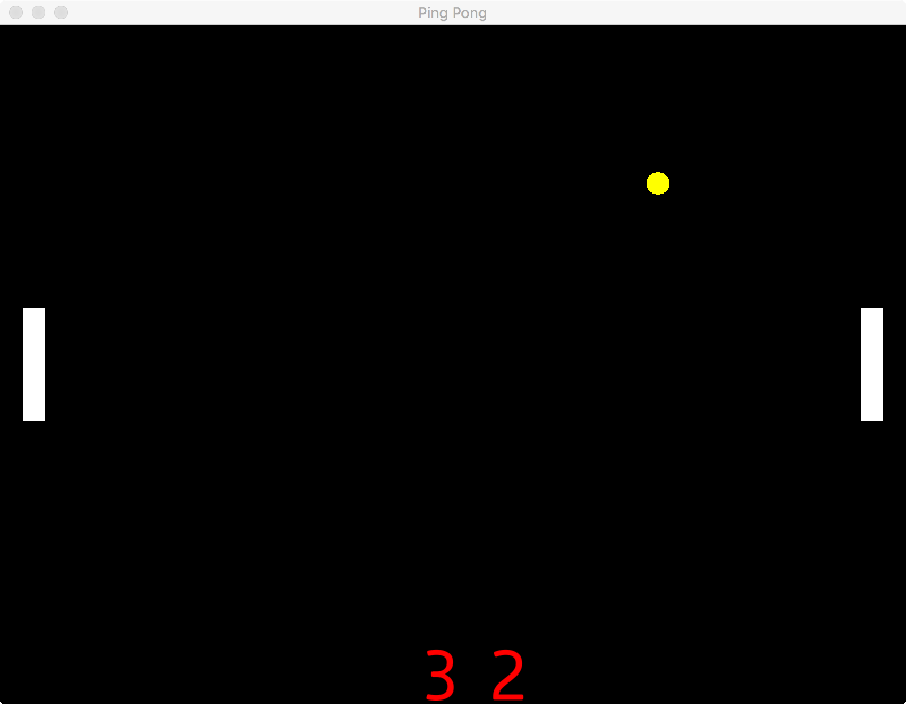

# Pong

A very simple game. 

I wrote this to learn quicksilver and the use of WebAssemby with Rust.

## Install WebAssembly target
```
rustup target add wasm32-unknown-unknown
cargo install cargo-web

```

## Run

Standalone
```
cargo run --release 

```
In a web browser
```
cargo web start

```

then point your browser to:

http://localhost:8000

